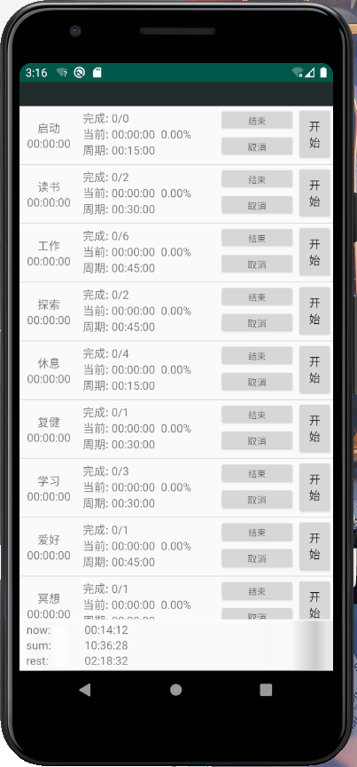

# 说明

这是一个用于追踪时间，以及解决拖延症的时间管理器，核心是”时间盒“，具体设计和使用方法可参见[此文](https://www.cnblogs.com/ishen/p/12345479.html)


# 目前
## 版本

v1.0 - > v1.1.0

相对于v1.0 新增了sqlite用来持久化数据和时间，使得app在日常的频繁后台以及restart情况下真实可用.

## 运行

目前已经基本完成了TimeMaster的开发，能够计时，工作任务, 运行截图界面如下起来如下:
 


## 配置

1.app没有做长保活，一直放在后台计时会不准确，可通过系统的设置，让app拥有常驻后台的权限，不同手机请自行百度.


2.如果想要修改任务，需要到MainActivity.java下的initTaskAndTime()函数中仿照添加task即可，如下:

```
//创建一个名为taskA的任务，其周期为 15分钟，一定要完成的个数是0
 Task add = new Task("others", 15 * 60 * timeDuration , 0, freeTime);
//添加到列表中
 messageList.add(m11);
 
```


# TODO

1. 设计每个task的完成得分，扣分规则
2. 设计得分机制，放入段位机制
3. 添加曲线图用于展示追踪